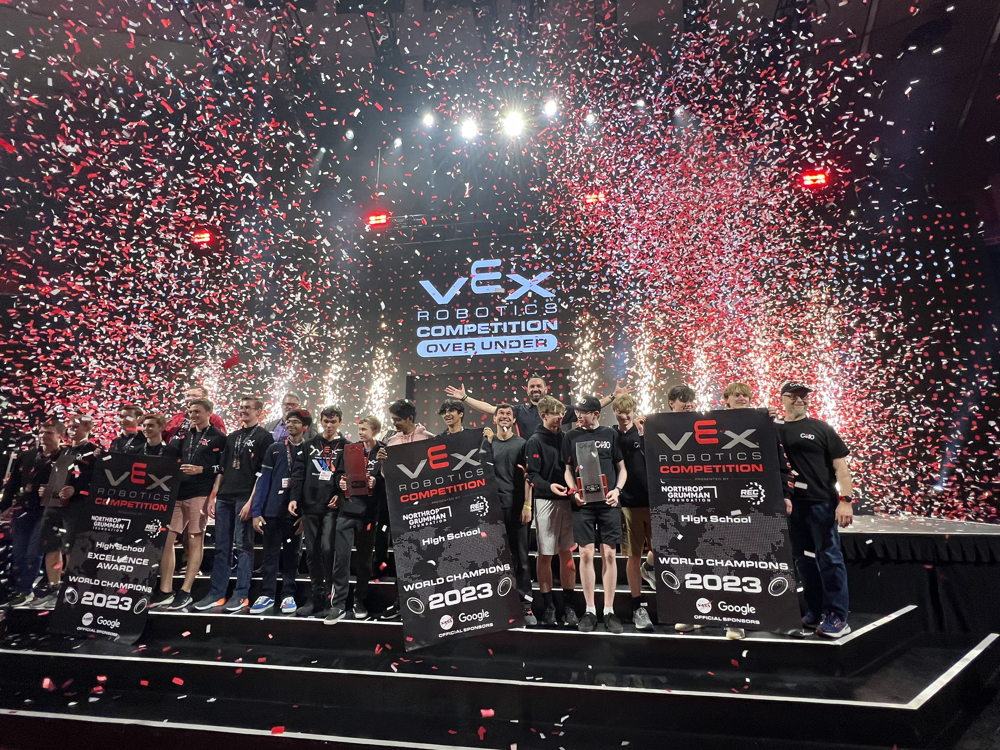

⚡️ **coding made ez** ⚡️

💅 **docs and tutorials** 💅 

💥 **pid, odometry, pure pursuit, boomerang** 💥

📚 **focus on consistency** 📚

🧐 **out of the box documentation** 🧐

🔌 **plug and play example project** 🔌

[See a complete playlist of EZ-Template autons here!](https://www.youtube.com/playlist?list=PLyZbi14KopZK70GTSD5NpygoAcM2_ls7T)

<iframe width="560" height="315" src="https://www.youtube.com/embed/BM-OUWSl0ls?si=jL3AAb3ARQmfZIWi" title="YouTube video player" frameborder="0" allow="accelerometer; autoplay; clipboard-write; encrypted-media; gyroscope; picture-in-picture; web-share" referrerpolicy="strict-origin-when-cross-origin" allowfullscreen></iframe>

## [Discord Server](https://discord.gg/EHjXBcK2Gy)
Need extra assistance using EZ-Template?  Feel free to join our [Discord Server](https://discord.gg/EHjXBcK2Gy)! 

## Features
EZ-Template is built with high attention to the user experience.

* Built with 💜 and [PROS](https://pros.cs.purdue.edu/)
  * Powerful open source Development platform for VEX V5 
  * Customize and extend with other community PROS libraries
* 🔌 Example project is plug-and-play
  * Simple to setup
  * Get up and running in minutes
* 👀 Simple to use API
  * PID for driving, turning, swing turns, and arcs
  * Odometry with Pure Pursuit and Boomerang
  * Asynchronous PID with blocking functions
  * "Tug of war" detection
  * Overheat detection and exiting
  * Live PID tuning
  * Tracking wheel support
* 📺 Autonomous selector
  * Easy to add autons
  * SD card saving
* 🎮 Joystick control
  * Tank drive, single stick arcade, and dual stick arcade
  * Joystick input curves
  * Adjust joystick curves live through the controller
* PID for your own subsystems
* Slew for your own subsystems

## Design Principles
* **Quick to get going.**  EZ-Template should make it easy to learn and use.  Anything is achievable by users, even if it takes them more code and more time to write.  
* **Intuitive.**  Users will not feel overwhelmed when looking at an EZ-Template project or adding new features.  It should look intuitive and easy to build on top of.  
* **Sensible Defaults.**  Common and popular performance optimizations and configurations will be done for users, but only with the option to override them.  

We believe that, as developers, knowing how a library works helps us become better at using it.  We're dedicating effort to creating tutorials and documentation with the hope that reading it will gain the user a deeper understanding of the tool, and become even more proficient in using it.  

## RECF Student Centered Policy

:::note 
EZ-Template is a tool, not a shortcut. Like any tool, it requires understanding to use effectively — a wrench doesn't fix your robot if you don't know what's loose.
Per G4c of the Game Manual, teams using third-party libraries must understand their competition code, be able to explain it, and be capable of writing equivalent code independently. EZ-Template's docs, source code, and examples are all written with this in mind — the goal is for students to actually learn, not just copy and paste.
If an event partner asks you to explain your autonomous, you should be able to.

:::

### Please always reference the RECF's [Student Centered Policy](https://kb.roboticseducation.org/hc/en-us/articles/5449868745367-Student-Centered-Policy#programming-coding-Smg21) and the [Override game manual](https://content.vexrobotics.com/docs/2026-2027/override/files/override-0.1-game-manual.pdf#V5RC%2026-27%20-%20Override.indd%3A%3CG4%3E%3A1969).

## [Support me on Patreon!](https://www.patreon.com/roboticsisez)
Supporting me on Patreon will help guarantee that EZ-Template continues to get maintained and allow me to develop products for teams to use.  [Click here](https://www.patreon.com/roboticsisez) to see my Patreon!

## [Download and Installation](/tutorials/installation)
Learn how to install and setup EZ-Template [here](/tutorials/installation)!
