## What is GitHub?
GitHub is a platform used for version control.  You can see every change made to your code, and revert back to old versions if something new doesn't work.  GitHub allows your entire team to view, edit, and update the code, and everyone will be able to use these new changes.  

In VRC, when we generally have one or two programmers, GitHub's best use is:
- a backup when something happens to your computer
- allowing the builders on your team to change things, such as tuning an autonomous mode, changing a port, or tuning a preset position

## Putting Code on GitHub

1) Make an account on [GitHub.com](https://github.com/).
2) Download [GitHub Desktop](https://desktop.github.com/). Sign into your account through Github Deksotp.

### Add Local Repository
"Repository" is essentially a fancy word for "folder".  We need GitHub to see what folder on your computer it should turn into a Git repository.  

Go to `File` -> `Add local repository`.  
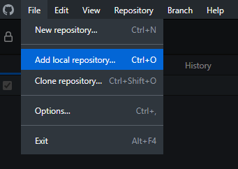  

Select `Choose`.  
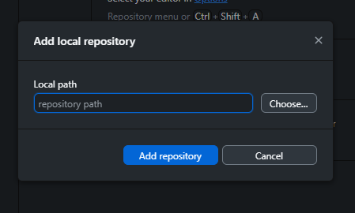  

Navigate through your computer and find your code.  Select it, and then select `Select folder` at the bottom left.  
  

Select `Add repository`.  
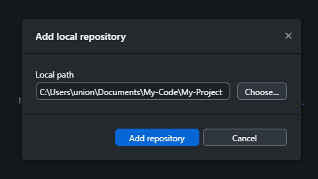  

Select `create a repository`.  
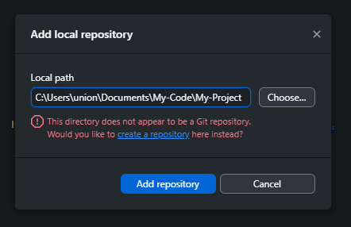  

Select `Create repository`.  
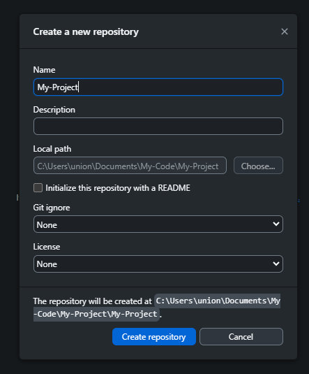  

### Publish Repository 
Now the repository is created on your computer, but we still need to put it onto GitHub.  Do this by selecting `Publish repository` either in the center of the screen or the top of the screen.  
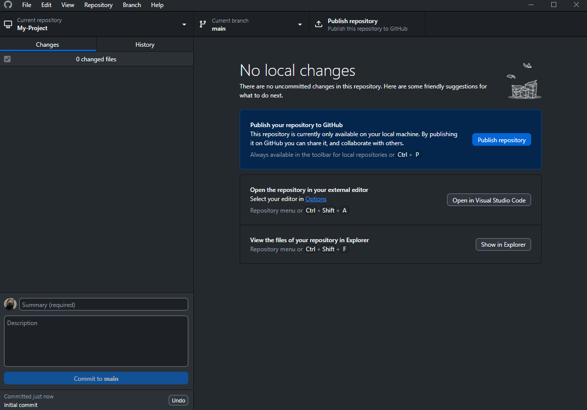

If you want your code to be public for anyone to see, deselect `Keep this code private`.  Leave it alone if you want your code to be private.  To put your repository on GitHub, select `Publish repository`.   
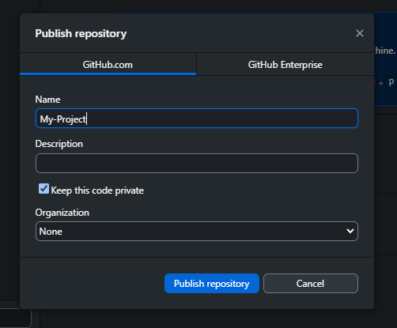

### Check GitHub.com
Now you can go to [GitHub.com](https://github.com/) and go to your repositories, and you'll see your code there!  
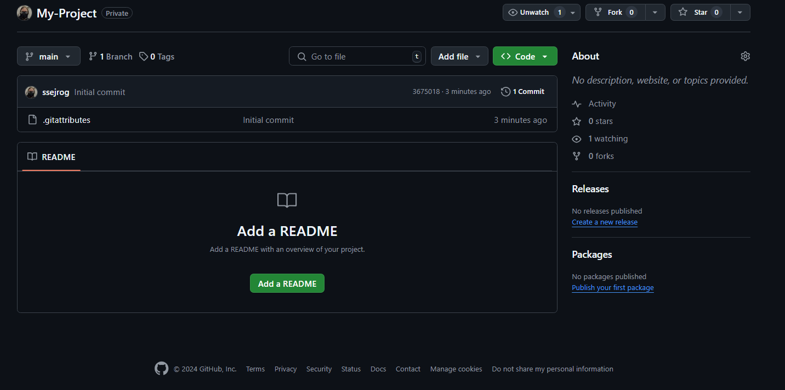

## Making Changes 
This is a five step process that you should be doing after every successful thing you get working, and at the end of every practice.  There is no harm in committing too much!

GitHub is only useful if you're using it. 

### Step 1: Open GitHub Desktop

### Step 2: Go to the Correct Repository
Select `Current Repository` in the top left and make sure it says the project you want to be in.  

### Step 3: Check Your Changes
Quickly look over what you've modified and make sure it is correct.  Everything in `red` has been removed, and everything in `green` has been added, make sure it looks correct.  The changes below are from me making this page!  
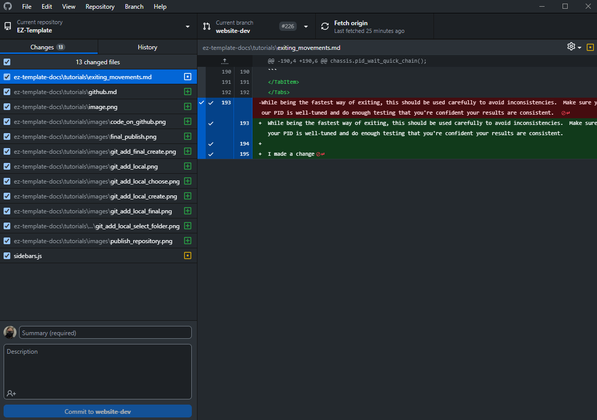

### Step 4: Type a Commit Message and Description 
In the bottom left, write a short description of what you changed.  
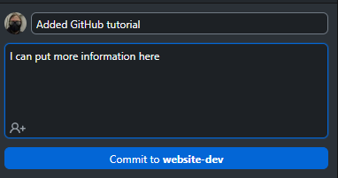

### Step 4: Commit Your Changes
Press `Commit to ...`, yours will say `Commit to main`.

### Step 5: Push origin
The code will not show to GitHub until you push to origin.  To do this, in the top center of your screen, press `Push to origin`.   
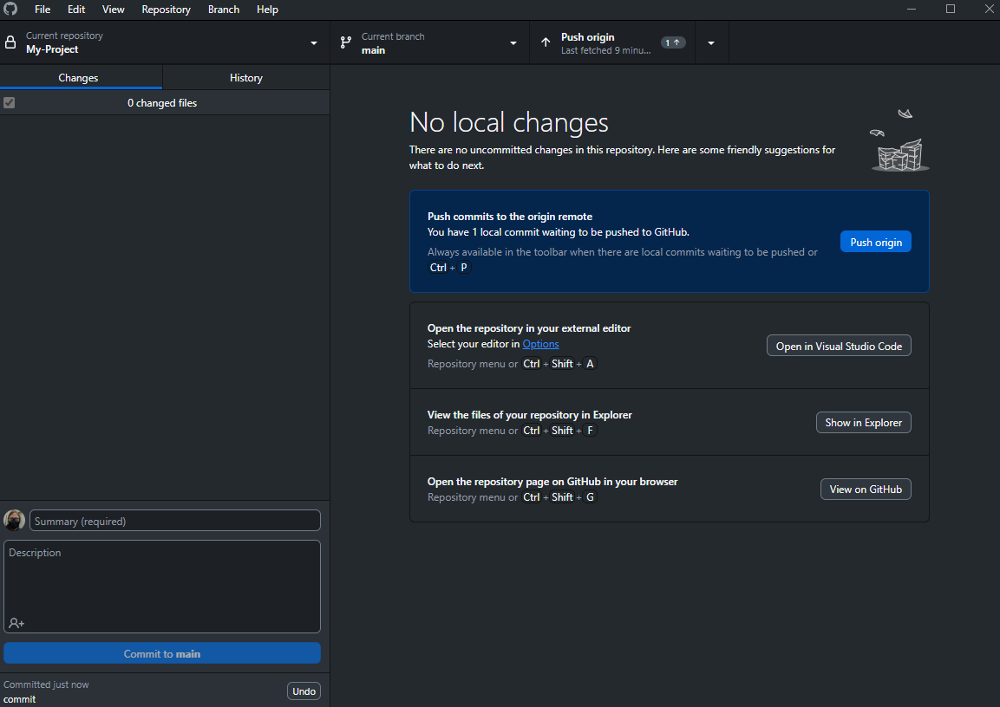

## Adding Teammates to Repository

I was going to write a tutorial on how to do this, but GitHub has written one better then I can, and I'm not going ot reinvent the wheel.  [So here you go!](https://docs.github.com/en/repositories/managing-your-repositorys-settings-and-features/managing-repository-settings/managing-teams-and-people-with-access-to-your-repository)

## My teammate uploaded code!  How do I get it on my computer?

### Cloning
Once your teammate is added to the repository, they'll need to get the code onto their computer.  This process is slightly different when it's being done for the first time vs when it's being done afterwards.  

Go to `File` -> `Clone repository`  
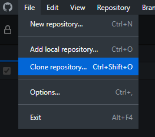  

Type in the name of the repository, decide where the code should live on your computer, and select `Clone`.  
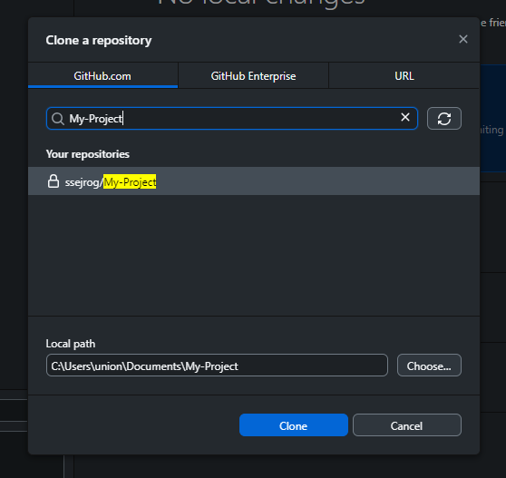  

### How to Pull
`Pulling` is when you take the code from GitHub and put it onto your computer.

In GitHub Desktop, go to `Repository` -> `Pull`.  If you've made changes, you can `stache` them for later.

## You're Done! 
You know how to use GitHub!

