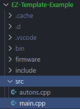
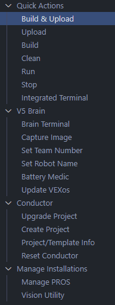

:::note

All versions of EZ-Template require you to use an [IMU](https://www.vexrobotics.com/276-4855.html).  You can find mounting instructions [here](https://kb.vex.com/hc/en-us/articles/360037382272-Using-the-V5-Inertial-Sensor).  

:::

## Download PROS
PROS is an open-source project developed by students at Purdue that gives us functions to interact with our V5 brain and other devices that connect to it.  If you don't have it installed, you can read their [Getting Started page here](https://pros.cs.purdue.edu/v5/getting-started/index.html).

## Download EZ-Template
Download the latest `EZ-Template-Example-Project-x.x.x.zip` [here](https://github.com/EZ-Robotics/EZ-Template/releases/latest) and extract the zip file.  [Click here](https://www.filecenter.com/blog/how-to-unzip-files-mac-iphone-android-windows/) if you're unsure how to extract a zip file.  

## Open EZ-Template-Example-Project
Add the folder to your workspace.  You can do this by going to `File` -> `Add Folder to Workspace`.  This will bring up a window and you'll have to navigate to where you extracted the example project.  If you're unsure where you extracted it, it's most likely in your `Downloads` folder.  

## Open `main.cpp`
You'll find `main.cpp` by selecting `EZ-Template-Example-Project` and opening `src`.  `main.cpp` is your main file where you can modify your user control code, the root of your autonomous routines, etc.  


## Configure the Drive Constructor
Near the top of `main.cpp` you'll see some code that looks like this.  This is your drive constructor, and it gives EZ-Template your chassis motor ports, the IMU port, the size of your wheels, and the rpm your wheels go at.  All of this information is needed so EZ-Template can make sure your robot is going the correct distances.  Configure these numbers to your robot.  
```cpp
// Chassis constructor
ez::Drive chassis(
    // These are your drive motors, the first motor is used for sensing!
 {1, 2, 3},     // Left Chassis Ports (negative port will reverse it!)
 {-4, -5, -6},  // Right Chassis Ports (negative port will reverse it!)

    7,      // IMU Port
    4.125,  // Wheel Diameter (Remember, 4" wheels without screw holes are actually 4.125!)
    343);   // Wheel RPM
```

## Build and Upload 
First, take a micro-USB cable and connect it between your computer and the robot.  You may also connect it to the controller, but only if your controller is already linked to the robot.  If you're unsure if your controller is paired or not, [read this article](https://kb.vex.com/hc/en-us/articles/360035592532-Pairing-the-V5-Controller-with-the-V5-Brain-for-a-Wireless-Connection).  

At the left of your screen, select this icon.   


Select `Build and Upload`.  Building your code makes sure you have no errors and sets everything up to upload your code to the robot.  Once this is complete, it will upload code to your robot.   


## Making Sure the IMU is Detected
Run the program on the brain.  You should see a loading bar come up on the brain.  If this bar goes completely red, you have a problem with your IMU.  You've either used the wrong port in your drive constructor, you have a bad cable, or you have a bad IMU.  You'll have to debug this to find out which one is bad.  

## Making Sure Drive Ports are Correct
The default drive mode for EZ-Template is tank drive, where the left stick controls the left side of the drive and the right stick controls the right side of the drive.  If all of the ports are set up correctly, the robot will drive!  

If the motors sound like they're running but they get locked up, you have a motor going in the wrong direction.  I suggest unplugging motors until you find the 1 going the wrong way, find out which port is going the wrong way, and update your drive constructor accordingly.  

## You're Setup!
🥳🥳You're all set up!  The next page will show you how to run the built-in example autonomous routines.  

