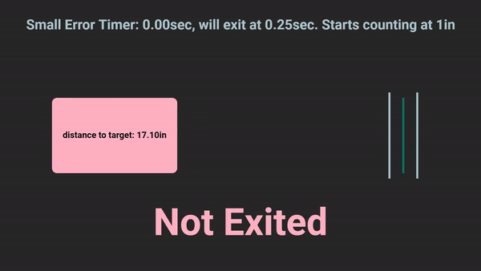
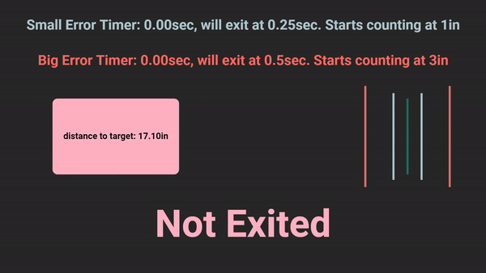
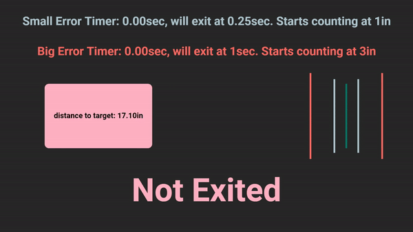

# Tuning Exit Conditions

## What is it?
Exit conditions are how EZ-Template decides it's time to move on from a motion.  This is like putting your code in a while loop until you've reached your target.  
```cpp
chassis.pid_drive_set(24_in, 110);
while (true) {
  if (robot_reaches_target()) {
    break;
  } else {
    // keep running because we're not there yet!
  }
  pros::delay(ez::util::DELAY_TIME);
}
```

See [this page](https://ez-robotics.github.io/EZ-Template/tutorials/example_autons) for example autonomous routines to see how exit conditions get implemented.  

Once the robot has "exited" the PID **does not** stop running.  EZ-Template will constantly run the PID in the background.  "Exiting" just means that the code is free to move on to the next task, which could mean intaking, raising a lift, or continuing onto the next drive motion.  

## How Does it Work?
### pid_wait()
EZ-Template's exit conditions are a little more special than that though.  We run timers to tell how long the robot has been within X of your target, and then exit once it's reached a threshold you've set.  This is what our exit conditions look like at their simplest.   
 

You can add another layer to this where it'll also check for a larger area.  Now 2 timers will run, one when you're within X of target and one when you're within Y of target.     
 

But when the robot enters the smaller exit zone, the big timer will not continue.  This can be seen here.     
 

There are 2 more timers that you can add on as well.  These are intended to be **failsafes** for when the previous two don't trigger fast enough or don't trigger at all.  One timer will start to increase when the velocity of the robot is 0, so if the robot is still for too long it'll exit.  Another timer will start once the robot sees it's pulling on the motors too hard (ie, you're fighting your opponent for a mobile goal), and if it's doing this for too long it'll exit.  

`pid_wait()` will be your safest way to exit, but with that, it's also going to be the slowest way to exit.  

### pid_wait_until()
`pid_wait_until()` is very similar to typing the code below.  This code will exit as soon as the robot has traveled 6 inches.  
```cpp
```cpp
double first_value = chassis.drive_sensor_left();
chassis.pid_drive_set(24_in, 110);
while (true) {
double distance_traveled = chassis.drive_sensor_left() - first_value;
  if (distance_traveled > 6.0) {
    break;
  } else {
    // keep running because we're not there yet!
  }
  pros::delay(ez::util::DELAY_TIME);
}
```

EZ-Template does a little more than just this though.  What if the robot never reaches 6 inches?  All of the normal exit conditions still run underneath `pid_wait_until()`.  So if the robot has 0 velocity for long enough, your robot will not be stuck there.  

The intended use case for this is if you want to do stuff during drive motions.  Now you can decide exactly when you want to, and after you've traveled 6 inches you can have your intake start spinning!  

### pid_wait_quick()
`pid_wait_quick()` is exactly the same as writing the code below.  It will `pid_wait_until(target)` but it'll replace `target` with wherever the last target you set was.  This way of exiting has a chance at being faster, because if the robot overshoots at all then the code will exit.  If you undershoot then it'll be as if you ran a normal `pid_wait()`.   
```cpp
chassis.pid_drive_set(24_in, 110);
chassis.pid_wait_until(24);
```

### pid_wait_quick_chain()
`pid_wait_quick_chain()` is your fastest way of exiting.  The code below is what happens internally.  You will tell the robot to go 24 inches, internally X will get added to target, and `pid_wait_until()` will get called with the target YOU entered.  While being the fastest way of exiting, this should be used with caution as it can lead to inconsistencies.  Make sure your PID is well-tuned and do enough testing that you're confident your results are consistent.   
```cpp
chassis.pid_drive_set(27_in, 110);  // You really want to go 24in
chassis.pid_wait_until(24);
```

## Tuning
Ultimately you're tuning for 2 functions; timers and when to start timing for `pid_wait()`, and how much to add to target for `pid_wait_quick_chain()`.  

### Tuning pid_wait()
The values to tune are in `default_constants()` in your `src/autons.cpp`.  The parameters are:
* The first number is the amount of time needed to exit when within the second number of your target  
* The third number is the amount of time needed to edit when within the fourth number of your target   
* The fifth number is the amount of time to edit when the velocity of the robot is 0  
* The sixth number is the amount of time to exit when you're pulling too many amps from your motors  
```cpp
void default_constants() {
  // . . .
  chassis.pid_turn_exit_condition_set(80_ms, 3_deg, 250_ms, 7_deg, 500_ms, 500_ms);
  chassis.pid_swing_exit_condition_set(80_ms, 3_deg, 250_ms, 7_deg, 500_ms, 500_ms);
  chassis.pid_drive_exit_condition_set(80_ms, 1_in, 250_ms, 3_in, 500_ms, 500_ms);
  // . . .
}
```

I like to use the `drive_and_turn()` example autonomous routine when tuning PID.  You get turns that happen back to back and some drive motions that lead into them.  

The default constants are already pretty aggressive, you shouldn't have to tune them much.  You can adjust the window that the timers start within and you can adjust the amount the timer has to reach before exiting.  If the window is too large, you'll exit too early.  If the time to wait is too low, you'll exit too early.  This can all be adjusted retroactively while making real autonomous routines 

You should make these numbers as low as you can without causing inconsistencies.  With `pid_wait()` you generally want the robot to be pretty close to stopped before it moves on to the next motion.  

### Tuning pid_wait_quick_chain()
You can tune the amount added to `target` during chained motions.  If this number is too large, you'll carry too much momentum into the next motion and will cause inconsistencies.  The only downside to this number being too small is potential wasted time as it could turn into a normal `pid_wait()` if you don't overshoot your target.  Generally, I would err on this being smaller.  


#### Driving
You have independent control over forward and backward constants for this.  If your robot doesn't have problems with tipping or wheel slip, you should be good with the normal `pid_drive_chain_constant_set()`.  
```cpp
void default_constants() {
  // . . .
  chassis.pid_drive_chain_constant_set(3_in);  // This sets forwards and backwards constants
  chassis.pid_drive_chain_forward_constant_set(3_in);
  chassis.pid_drive_chain_backward_constant_set(3_in);
  // . . .
}
```

#### Turning
This is the simple one.  We assume your robot is symmetrical in turning and you only get 1 function to tune.  
```cpp
void default_constants() {
  // . . .
  chassis.pid_turn_chain_constant_set(3_deg);  
  // . . .
}
```

#### Swinging
You have independent control over forward and backward constants for this.  If your robot doesn't have problems with tipping or wheel slip, you should be good with the normal `pid_swing_chain_constant_set()`.  
```cpp
void default_constants() {
  // . . .
  chassis.pid_swing_chain_constant_set(5_deg);  // This sets forwards and backwards constants
  chassis.pid_swing_chain_forward_constant_set(5_deg);
  chassis.pid_swing_chain_backward_constant_set(5_deg);
  // . . .
}
```