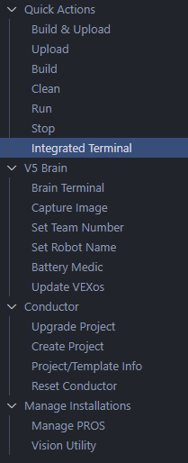

:::warning

This only works for 2.x and beyond.  You cannot upgrade from 1.x to 2.x, or 2.x to 3.x without changing code.  See more about migration [here](/category/migration).

:::

## Download EZ-Template
Download the most recent `EZ-Template@x.x.x.zip` [here](https://github.com/EZ-Robotics/EZ-Template/releases/latest).  

## Bring the File Into Your Project
Bring this file into your project.  You can do this through file explorer or by dragging it into VScode.  

## Open Integrated Terminal 
### Select the PROS Icon on the Left

### Select `Integrated Terminal`


## Fetch the File
Type the text below in the terminal, replacing `x.x.x` with the version of your file.  Press Enter.
```
pros c fetch EZ-Template@x.x.x.zip
```

## Apply EZ-Template to Your Project
:::warning

Ensure that your PROS kernel version at least the same as EZ-Template!  Run `pros c upgrade kernel@latest` if you're unsure.  

:::

Apply EZ-Template to your project by typing below, replacing `x.x.x` with the version of your file.  Press Enter.
```
pros c apply EZ-Template@x.x.x
```

## You're Done!
That's it!  You've now updated to the most recent version of EZ-Template!
